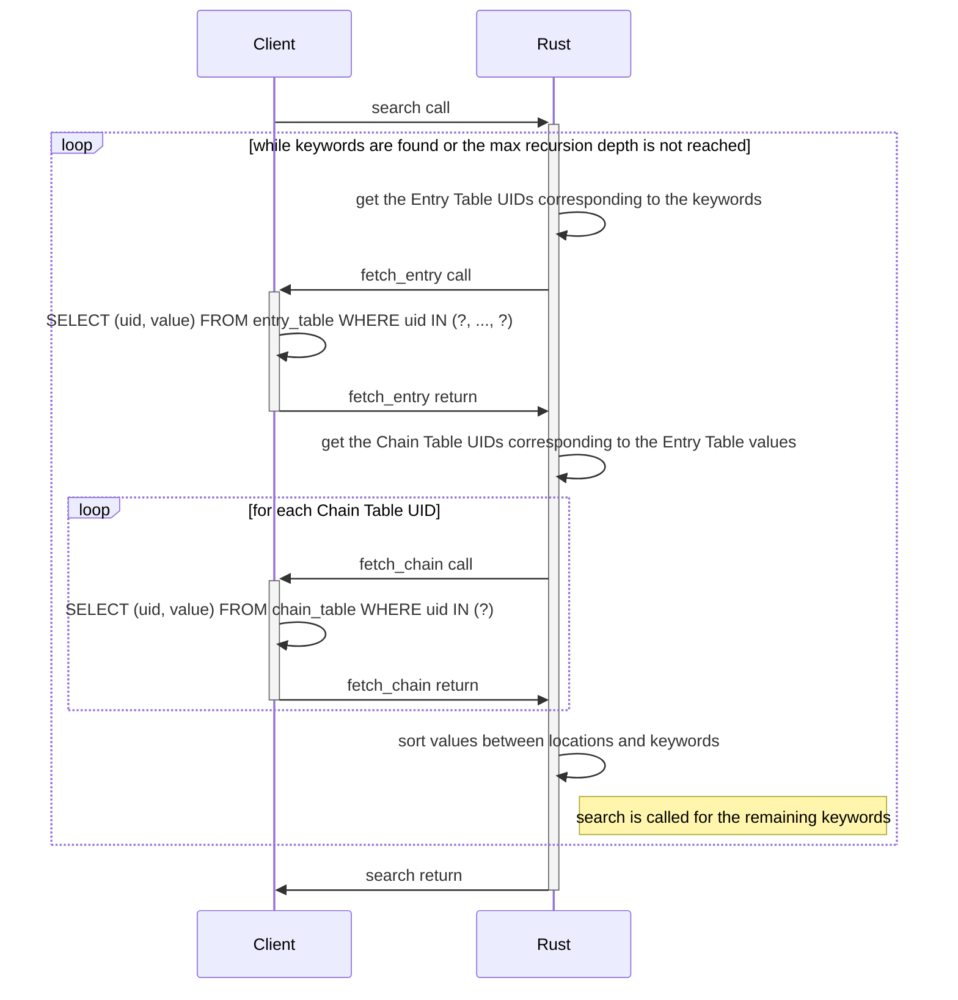
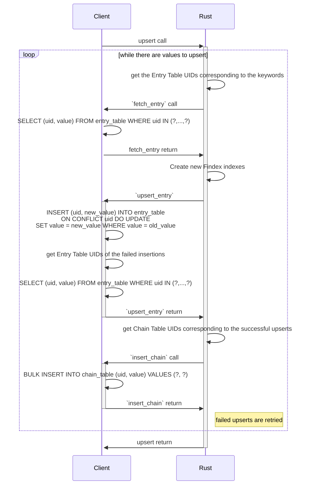
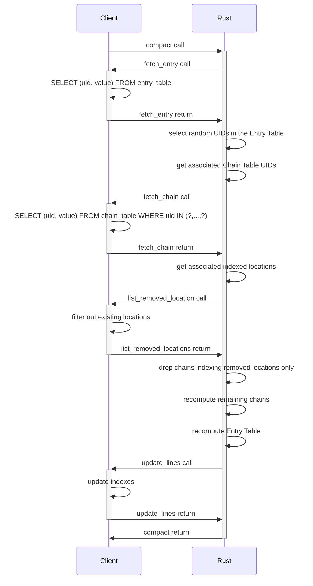

# Findex


Findex is a cryptographic protocol designed to securely make search queries on
an untrusted cloud server. Thanks to its encrypted indexes, large databases can
securely be outsourced without compromising usability.

Findex is part of Cosmian Cloudproof Encryption.

<!-- toc -->

- [Getting started](#getting-started)
- [Building and testing](#building-and-testing)
- [Features and benchmarks](#features-and-benchmarks)
  - [Index tables](#index-tables)
  - [Findex callbacks](#findex-callbacks)
  - [Findex search](#findex-search)
    - [Implementation details](#implementation-details)
  - [Findex upsert](#findex-upsert)
    - [Implementation details](#implementation-details-1)
    - [Two indexing strategies](#two-indexing-strategies)
  - [Findex compact](#findex-compact)
    - [Implementation details](#implementation-details-2)
  - [Benchmarks](#benchmarks)
- [Documentation](#documentation)

<!-- tocstop -->

## Getting started

Findex allows to index values by keywords. These values can be locations (UIDs
in an encrypted database, URLs etc.) or other keywords (see section [Two
indexing strategies](#two-indexing-strategies)).

Findex delegates to the user the implementation of *callbacks* to manipulate
the indexes. This makes Findex compatible with any database technology since
no database-specific code is part of it. These callbacks need to be implemented
through the trait `FindexCallbacks`. See the section
[Callbacks](#findex-callbacks) for an implementation example.

The main Findex traits can be derived automatically using the provided macros
(see [`in_memory_example.rs`](./src/in_memory_example.rs#L203-207) for an
example).

The generics used by Findex are defined in [`parameters.rs`](./src/parameters.rs).
Their values allow using AES-256-GCM and minimizing the size of the indexes.

## Building and testing

To build Findex without the interfaces, run:

```bash
cargo build --release
```

To run all the tests, run:

```bash
cargo test --release --all-features
```

## Features and benchmarks

### Index tables

Findex relies on two server-side indexes - Entry Table and Chain Table - to
solve the following search problem:

> How to securely recover the *location* of an encrypted data matching a given
> keyword?

- Entry Table: provides the values needed to fetch the correct locations from
  the Chain Table.
- Chain Table: securely stores the indexed values. These indexed values may be
  locations or pointers to other keywords. Locations usually are database UIDs,
  but Findex can be used to index any kind of location (URL, path...).

Findex index tables are key value stores which structure is given in the
following tables.

<table style="width:50%">
	<tr>
		<th colspan=4>Entry Table</th>
	</tr>
	<tr>
		<th>key</th>
		<th colspan=3>value</th>
	</tr>
	<tr>
		<td>UID</td>
		<td>$K_{w_i}$</sub></td>
		<td>$H_{w_i}$</sub></td>
		<td>$UID_{last}$</td>
	</tr>
</table>

<table style="width:50%">
	<tr>
		<th colspan=4>Chain Table</th>
	<tr>
	<tr>
		<th>key</th>
		<th colspan=3>value</th>
	</tr>
	<tr>
		<td>UID</td>
		<td>Block<sub>1</sub></td>
		<td>...</td>
		<td>Block<sub>B</sub></td>
	</tr>
</table>

Where:
- the keys used are random-like 32 bytes long UIDs.
- the values are symmetrically encrypted with an AEAD (using a 16-bytes MAC tag
  and a 12-bytes nonce).
- there is one Entry Table line per keyword $w_i$.
- the $K_{w_i}$ is a 16-bytes seed used to generate the Chain Table values
  associated to the keyword $w_i$.
- the $H_{w_i}$ is a 32-bytes hash of the keyword $w_i$ that is used by the compact
  operation.
- the UID stored in the Entry Table corresponds to the last Chain Table UID
  that stores values indexed by $w_i$.
- the blocks stored in the Chain Table are used to pad the Chain Table lines to
  an equal size. Each block is 16-bytes long (which is enough to store an
  UUID). An indexed value is stored in the Chain Table by chunks of 16 bytes.
  The last chunk may not be full and is padded with 0s.
- the number of blocks per Chain Table value ($B$) used is 5.

The Chain Table values are serialized as follows (sizes are given in bytes):

<table>
	<tr>
		<th rowspan=2>flag</th>
		<th colspan=2>Block<sub>1</sub></th>
		<th>...</th>
		<th colspan=2>Block<sub>B</sub></th>
	</tr>
	<tr>
		<th>prefix</th>
		<th>data</th>
		<th>...</th>
		<th>prefix</th>
		<th>data</th>
	</tr>
	<tr>
		<td>1</td>
		<td>1</td>
		<td>16</td>
		<td>...</td>
		<td>1</td>
		<td>16</td>
	</tr>
</table>

The flag is used to mark the blocks as being addition or deletions (cf [Findex
upsert](#findex-upsert)). Each bit corresponds to a block, which limits the
possible number of blocks inside a single Chain Table value to 8. The prefix is
used to write the actual length of the data stored inside a block.

Therefore, given $N$ the number of keywords used, the size of the Entry Table
is given by (in bytes):

``` math
L_{entry~table} = (L_{uid} + C_e + L_{K_{w_i}} + L_{H_{w_i}} + L_{uid}) \cdot N
                = 140 \cdot N
```

Given $V(w_i)$ the volume of the keyword $w_i$ (i.e. the number of values
indexed by this keyword), and if each indexed value fits in a single block, the
size of the compacted Chain Table is given by (in bytes):

``` math
L_{chain~table} = \left(L_{uid} + C_e + 1 + B * (1 + L_{block})\right) \sum\limits_{i~\in~[1,N]}\left\lceil \frac{V(w_i)}{B}\right\rceil
                = 146 \sum\limits_{i~\in~[1;N]}\left\lceil \frac{V(w_i)}{B}\right\rceil
```

where:
- the UID length: $L_{uid} = 32~\textnormal{bytes}$
- the encryption overhead: $C_e = 28~\textnormal{bytes}$
- the block length: $L_{block} = 16~\textnormal{bytes}$
- the Chain Table width: $B = 5~\textnormal{bytes}$

**Example**:
- if an index contains 1000 keywords, the size of the Entry Table is 140KB. If
  each keyword indexes an only value (i.e. $V(w_i) = 1$ for each $w_i$), the
  size of the Chain Table is 146KB.
- adding a new keyword in the indexes increases the Entry Table size of 140B.
- indexing up to 5 new values for a given keyword increases the Chain Table
  size of 146B.

### Findex callbacks

Findex implementation uses callback functions. The signature of these callbacks
and a detailed description of the functionalities they need to implement is
given in the core [`callbacks.rs`](./src/callbacks.rs).

An example implementation of the Findex callbacks in Rust for an in-memory
database is available in [`in_memory_example.rs`](./src/in_memory_example.rs).

### Findex search

Searching Findex indexes for keywords is done through the method `search`
implemented by the trait `FindexSearch`. When some searched keywords index
other keywords, `search` recursively follows these indexations until a location
is found or the maximum recursion level is reached depending on whichever comes
first.

Parameter documentation and method signature can be found in
[`search.rs`](./src/search.rs#L137-150).

#### Implementation details

The following sequence diagram illustrates the `search` process.



### Findex upsert

Indexing values is done through the method `upsert` implemented by the trait
`FindexUpsert`. It allows indexing and desindexing values for a set of
keywords. When desindexing a value for a given keyword, a suppression of this
value is added to the chain of this keyword. Any preceding addition of this
value in the chain will be ignored by subsequent search queries. The value can
later be reindexed for this keyword by upserting it again.

Parameter documentation and method signature can be found in
[`upsert.rs`](./src/upsert.rs#L35-52).

#### Implementation details

The following sequence diagram illustrates the `upsert` process.



#### Two indexing strategies

Naive (locations are indexed for all possible slices):

- `mar` -> {locations}
- `mart` -> {locations}
- `marti` -> {locations}
- `martin` -> {locations}
- `martine` -> {locations}

Graph:

- `mar` -> `mart`
- `mart` -> `marti`
- `marti` -> `martin`
- `martin` -> `martine`
- `martine` -> {locations}

Disadvantage of graphs: more interactions between client and server: 4 average
compared to 1 for the naive solution.

Advantage of graphs: optimal storage of the locations info since they are not
repeated in the chain table.

| Avg locations | #records graphs | #records naive | ratio | size (kb) graphs | size (kb) naive | ratio |
|---------------|-----------------|----------------|-------|------------------|-----------------|-------|
| 1             | 86018           | 86018          | 1.00  | 5605             | 5704            | 1.01  |
| 2             | 105966          | 172036         | 1.62  | 6994             | 11745           | 1.68  |
| 3             | 125914          | 258054         | 2.04  | 8344             | 17618           | 2.11  |
| 4             | 145862          | 244072         | 2.35  | 9694             | 23491           | 2.42  |
| 5             | 165810          | 430090         | 2.59  | 11044            | 29364           | 2.65  |

### Findex compact

With the time, some indexed locations will become obsolete. Moreover,
successive upserts start adding values to the chains in a new line while the
previous line may not be full. Therefore, after some location deletions and
some upserts, indexes may waste a lot of space. This is why a compacting
operation is needed.

Parameter documentation and method signature can be found in
[`compact.rs`](./src/compact.rs#L38-59).

#### Implementation details

A compacting operation fetches the entire Entry Table and decrypts it. A random
subset of this table is then selected and the corresponding chains are fetched
from the Chain Table and recomputed from a new random `Kwi`. This allows
removing obsolete locations, deleted values and avoiding useless padding in the
Chain Table values. Only the last Chain Table value in a chain may need
padding. The Entry Table values of the selected subset are updated with the new
`Kwi` and last chain UID. The UIDs of the entire Entry Table are rederived from
a new key and a label, and the table is encrypted using a key derived from this
new key. The chains are encrypted using a key derived from the new `Kwi`s. The
old chains are removed from the Chain Table, the new chains are added, and the
new Entry Table replaces the old one.

The following sequence diagram illustrates the `compact` process.



### Benchmarks

The benchmarks presented in this section are run on a Intel(R) Xeon(R) Platinum 8171M CPU @ 2.60GHz.

- [Findex in memory (no database)](./benches/BENCHMARKS.md)

## Documentation

Findex technical documentation can be found [here](https://github.com/Cosmian/findex/blob/main/documentation/Findex.pdf).

The developer documentation can be found on [doc.rs](https://docs.rs/cosmian_findex/latest/cosmian_findex/index.html)
