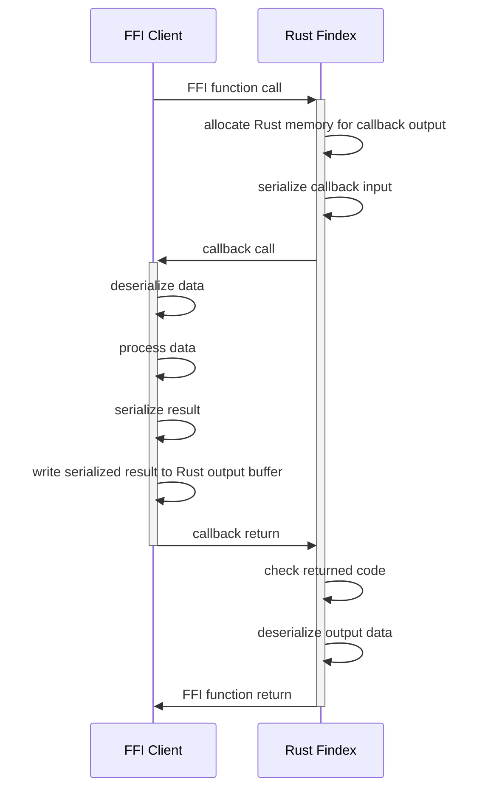
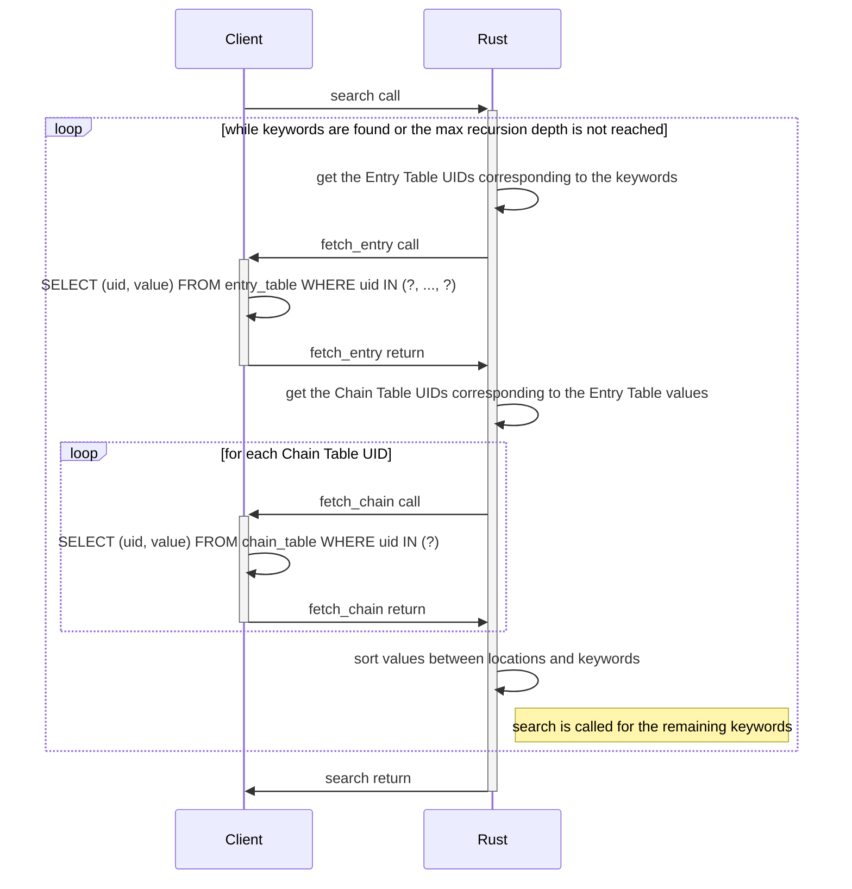
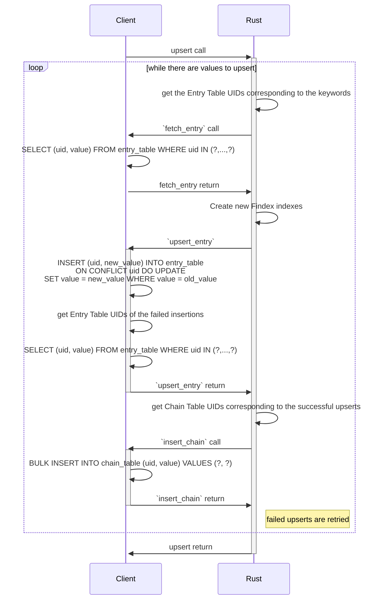
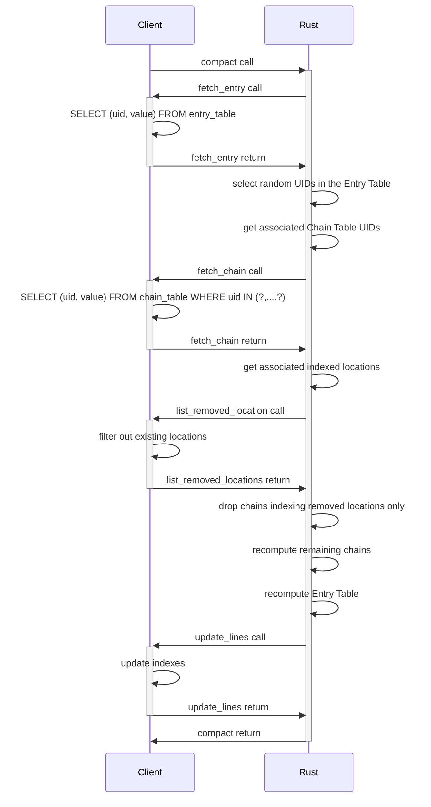

# Findex &emsp; [![Build Status]][actions] [![Latest Version]][crates.io]

[build status]: https://img.shields.io/github/workflow/status/Cosmian/findex/CI%20checks/main
[actions]: https://github.com/Cosmian/findex/actions?query=branch%3Amain
[latest version]: https://img.shields.io/crates/v/cosmian_findex.svg
[crates.io]: https://crates.io/crates/cosmian_findex

Findex is a cryptographic protocol designed to securely make search queries on
an untrusted cloud server. Thanks to its encrypted indexes, large databases can
securely be outsourced without compromising usability.

Findex is part of Cosmian Cloudproof Encryption.

<!-- toc -->

- [Getting started](#getting-started)
- [Building and testing](#building-and-testing)
- [Features and Benchmarks](#features-and-benchmarks)
  - [Index tables](#index-tables)
  - [Findex callbacks](#findex-callbacks)
  - [Findex search](#findex-search)
  - [Findex upsert](#findex-upsert)
  - [Findex compact](#findex-compact)
- [Documentation](#documentation)

<!-- tocstop -->

## Getting started

Findex allows to index values by keywords. These values can be locations (UIDs
in an encrypted database, URLs etc.) or other keywords. This allows creating
graphs of keywords as described in the section [Two indexing
strategies](#two-indexing-strategies).

Findex delegates to the user the implementation of *callbacks* to manipulate
the indexes. This makes Findex compatible with any database technology since
no database-specific code is part of it. These callbacks need to be implemented
through the trait `FindexCallbacks`. See the section
[Callbacks](#findex-callbacks) for an implementation example.

The main Findex traits can be derived automatically (see
[`ffi/core/traits.rs`](./src/interfaces/ffi/core/traits.rs#L254-297) for an
example).

The generics used by Findex are defined in [`generic_parameters.rs`](./src/interfaces/generic_parameters.rs).
Their values allow using AES-256-GCM and KMAC128 and minimizing the size of the indexes.

## Building and testing

To build Findex without the interfaces, run:

```bash
cargo build --release
```

To build the FFI interface, run:

```bash
cargo build --release --features ffi
```

To build the WebAssembly interface, run:

```bash
cargo build --release --features wasm_bindgen
```

To build the Python interface, run:

```bash
maturin build --release --features python
```

**Note**: when a new function or class is added to the PyO3 interface, its
signature needs to be added to [`__init__.pyi`](./python/cosmian_findex/__init__.pyi).

To run tests on the Python interface, run:

```bash
./python/scripts/test.sh
```

And finally, to build everything and test it, run:

```bash
cargo build --release --all-features
cargo test --release --all-features
```

## Features and benchmarks

### Index tables

Findex relies on two server-side indexes - Entry Table and Chain Table - to
solve the following search problem:

> How to securely recover the UIDs of DB Table to obtain the matching lines
> from a given keyword?

- Entry Table: provides the mandatory values to access the Chain Table.
- Chain Table: securely stores the indexed values. In the case this solution is
  built on top of an encrypted database, the Chain Table would store  UIDs of
  this table, but Findex can be used to index any kind of value (URL, path...).

Each index table contains two columns: the `uid` and `value` columns:

|              | uid        | value     |
| ------------ | ---------- | --------- |
| Size (bytes) | UID_LENGTH | see below |

Where `UID_LENGTH = 32`. The table values contain encrypted data:

|              | AES-GCM encrypted data  | MAC | Nonce |
| ------------ | ------------------------| --- | ----- |
| Size (bytes) | see below               | 16  | 12    |

The encrypted data for the Index Entry Table is:

|              | Entry Table encrypted data                    |
| ------------ | --------------------------------------------- |
| Size (bytes) | KWI_LENGTH + UID_LENGTH + KEYWORD_HASH_LENGTH |

where `KWI_LENGTH = 16` and `KEYWORD_HASH_LENGTH = 32`. The encrypted data for
the Chain Table is:

|              | Chain Table encrypted data  |
| ------------ | --------------------------- |
| Size (bytes) | TABLE_WIDTH \* BLOCK_LENGTH |

where `TABLE_WIDTH = 5`, and `BLOCK_LENGTH = 32`.

Therefore, given `N` the number of indexing keywords, the size of the Entry
Table in bytes is given by:

``` text
N * (UID_LENGTH + ENCRYPTION_OVERHEAD + KWI_LENGTH + UID_LENGTH + KEYWORD_HASH_LENGTH)
= N * 140
```

Given `M` the average number of values indexed by keyword, the size of the
compacted Chain Table in bytes is given by:

``` text
N * ceil(M / TABLE_WIDTH) * (UID_LENGTH + ENCRYPTION_OVERHEAD + TABLE_WIDTH * BLOCK_LENGTH)
= N * ceil(M / 5) * 220
```

where `ceil()` is the ceiling function that maps x to the least integer greater
than or equal to x.

### Findex callbacks

Findex implementation uses callback functions. The signature of these callbacks
and a detailed description of the functionalities they need to implement is
given in the core [`callbacks.rs`](./src/core/callbacks.rs).

An example implementation of the Findex callbacks in Rust for an SQLite
database is available in [`findex.rs`](./src/interfaces/sqlite/findex.rs).

**Note**: for the FFI interface, serialization is needed and a pagination
should be implemented to fetch the entire Entry Table in `fetch_entry_table()`.
A detailed documentation of the serialization is given in the FFI
[`callbacks.rs`](./src/interfaces/ffi/core/callbacks.rs). The following figure
summarizes the serialization process in FFI callbacks.



### Findex search

Searching Findex indexes for keywords is done through the method `search`
implemented by the trait `FindexSearch`. When some searched keywords index
other keywords, `search` recursively follows these indexations until a location
is found or the maximum recursion level is reached depending on whichever comes
first.

Parameter documentation and method signature can be found in
[`search.rs`](./src/core/search.rs#L133-156).

#### Implementation details

The following sequence diagram illustrates the `search` process.



### Findex upsert

Indexing values is done through the method `upsert` implemented by th trait
`FindexUpsert`. It allows indexing values (locations or keywords) by a set of
keywords.

Parameter documentation and method signature can be found in
[`upsert.rs`](./src/core/upsert.rs#L35-50).

#### Implementation details

The following sequence diagram illustrates the `upsert` process.



#### Two indexing strategies

Naive (locations are indexed for all possible slices):

- `mar` -> {locations}
- `mart` -> {locations}
- `marti` -> {locations}
- `martin` -> {locations}
- `martine` -> {locations}

Graph:

- `mar` -> `mart`
- `mart` -> `marti`
- `marti` -> `martin`
- `martin` -> `martine`
- `martine` -> {locations}

Disadvantage of graphs: more interactions between client and server: 4 average
compared to 1 for the naive solution.

Advantage of graphs: optimal storage of the locations info since they are not
repeated in the chain table.

TODO: what does the `size` represent?

| Avg locations | #records graphs | #records naive | ratio | size (kb) graphs | size (kb) naive | ratio |
| ------------- | --------------- | -------------- | ----- | ---------------- | --------------- | ----- |
| 1             | 86018           | 86018          | 1.00  | 5605             | 5704            | 1.01  |
| 2             | 105966          | 172036         | 1.62  | 6994             | 11745           | 1.68  |
| 3             | 125914          | 258054         | 2.04  | 8344             | 17618           | 2.11  |
| 4             | 145862          | 244072         | 2.35  | 9694             | 23491           | 2.42  |
| 5             | 165810          | 430090         | 2.59  | 11044            | 29364           | 2.65  |

### Findex compact

With the time, some indexed locations will become obsolete. Moreover,
successive upserts start adding values to the chains in a new line while the
previous line may not be full. Therefore, after some location deletions and
some upserts, indexes may waste a lot of space. This is why a compacting
operation is needed.

Parameter documentation and method signature can be found in
[`compact.rs`](./src/core/compact.rs#L39-67).

#### Implementation details

A compacting operation fetches the entire Entry Table and decrypts it. A
random subset of this table is then selected and the corresponding chains are
fetched from the Chain Table and recomputed from a new random `Kwi`. This
allows removing obsolete locations and avoiding useless padding in the Chain
Table values. Only the last Chain Table value in a chain may need padding. The
Entry Table values of the selected subset are updated with the new `Kwi` and
last chain UID. The UIDs of the entire Entry Table are rederived from a new key
and a label, and the table is encrypted using a key derived from this new key.
The chains are encrypted using a key derived from the new `Kwi`s. The old
chains are removed from the Chain Table, the new chains are added, and the new
Entry Table replaces the old one.

The following sequence diagram illustrates the `compact` process.



### Benchmarks

TODO

## Documentation

Findex technical documentation can be found here: TODO
