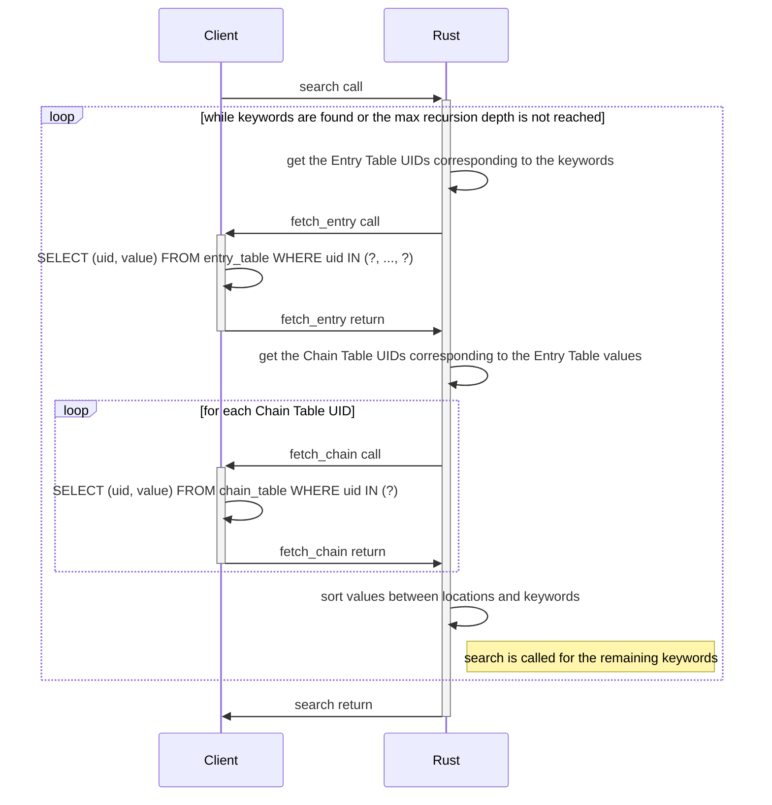
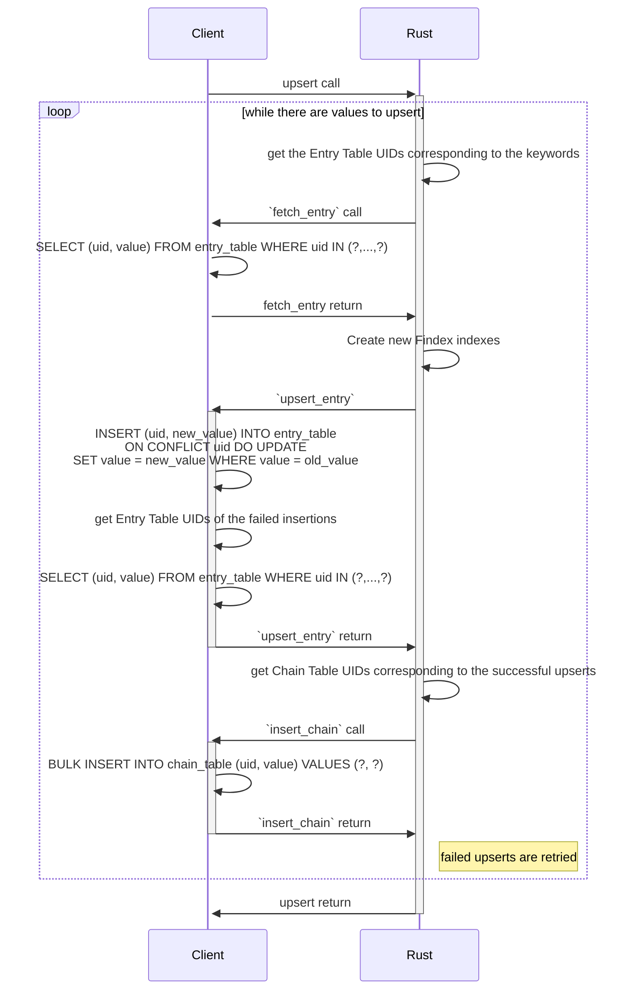
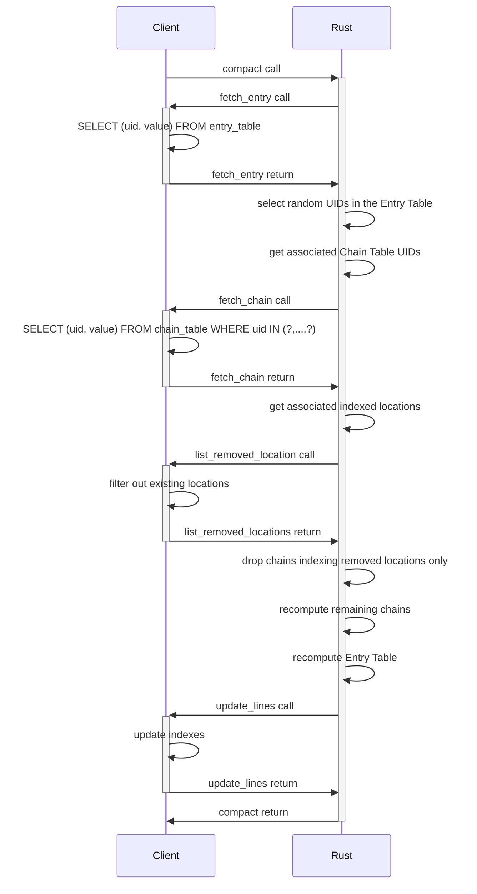

# Findex callbacks

Findex implementation uses callback functions. The signature of these callbacks
and a detailed description of the functionalities they need to implement is
given in the core [`callbacks.rs`](./src/callbacks.rs).

An example implementation of the Findex callbacks in Rust for an in-memory
database is available in [`in_memory_example.rs`](./src/in_memory_example.rs).

## Findex search

Searching Findex indexes for keywords is done through the method `search`
implemented by the trait `FindexSearch`. When some searched keywords index
other keywords, `search` recursively follows these indexations until a location
is found or the maximum recursion level is reached depending on whichever comes
first.

Parameter documentation and method signature can be found in
[`search.rs`](./src/search.rs#L137-150).

### Implementation details

The following sequence diagram illustrates the `search` process.

## Findex upsert

Indexing values is done through the method `upsert` implemented by the trait
`FindexUpsert`. It allows indexing and desindexing values for a set of
keywords. When desindexing a value for a given keyword, a suppression of this
value is added to the chain of this keyword. Any preceding addition of this
value in the chain will be ignored by subsequent search queries. The value can
later be reindexed for this keyword by upserting it again.

Parameter documentation and method signature can be found in
[`upsert.rs`](./src/upsert.rs#L35-52).

### Implementation details

The following sequence diagram illustrates the `upsert` process.

## Findex compact

With the time, some indexed locations will become obsolete. Moreover,
successive upserts start adding values to the chains in a new line while the
previous line may not be full. Therefore, after some location deletions and
some upserts, indexes may waste a lot of space. This is why a compacting
operation is needed.

Parameter documentation and method signature can be found in
[`compact.rs`](./src/compact.rs#L38-59).

### Implementation details

A compacting operation fetches the entire Entry Table and decrypts it. A random
subset of this table is then selected and the corresponding chains are fetched
from the Chain Table and recomputed from a new random `Kwi`. This allows
removing obsolete locations, deleted values and avoiding useless padding in the
Chain Table values. Only the last Chain Table value in a chain may need
padding. The Entry Table values of the selected subset are updated with the new
`Kwi` and last chain UID. The UIDs of the entire Entry Table are rederived from
a new key and a label, and the table is encrypted using a key derived from this
new key. The chains are encrypted using a key derived from the new `Kwi`s. The
old chains are removed from the Chain Table, the new chains are added, and the
new Entry Table replaces the old one.

The following sequence diagram illustrates the `compact` process.

