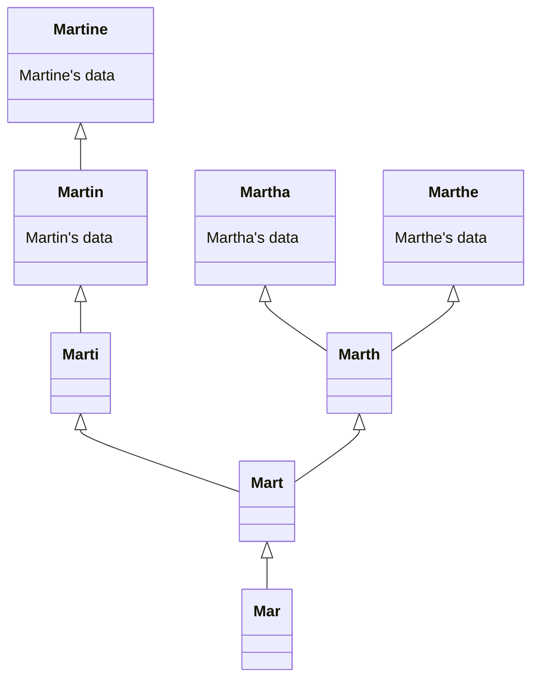

# Findex functional documentation

## How to securely manage an index

The goal of Findex is to allow users to securely manage an index. To know more
about the security guarantees of Findex, see the [security][sec_doc]
documentation.

### An index as a graph

An index can be thought of as a graph: each indexed keyword is associated to a
node, which contains all data indexed under this keyword; some of this data can
be other keywords which can be represented as directed edges linking the
vertices of each one of the associated keywords.



### An index as a multi-map

The graph presented above can also be seen as a multi-map, storing the list of
indexed values associated to each keyword. These indexed values can either be
an associated data or an associated keyword. It is possible to retrieve the
results stored in the graph by iteratively searching for keywords: all
associated keywords found during a search are fed to the new search iteration.

```txt
{
    'Mar': { Keyword('Mart') },
    'Mart': {
        Keyword('Marth'),
        Keyword('Marti'),
    },
    'Marth': {
        Keyword('Martha'),
        Keyword('Marthe'),
    },
    'Marti': { Keyword('Marthin') },
    'Martha': { Data("Martha's data") },
    'Marthe': { Data("Marthe's data") },
    'Martin': {
        Keyword('Martine'),
        Data("Martin's data"),
    },
    'Martine': { Data("Martine's data") },
}
```

The issue with this structure is that it is not secure enough (even when
encrypted, the number of results is apparent and could allow distinguishing
some keywords).

### An index as a couple of dictionaries

Each multi-map value can be split into values of equal sizes called links, as
described in the [serialization][serialization_doc] documentation. The sequence
of links that is generated from a given multi-map value is called a chain. This
allows representing the multi-map using two dictionary encryption schemes:

- the first DX-Enc is called **Chain Table**: it contains all the chains
  generated from all the multi-map values.
- the second DX-Enc is called **Entry Table**: it contains for each keyword all
  the metadata needed to retrieve the entire chain from the Chain Table.

The role of Findex is therefore to transform [index][index_trait] requests into
[DX-Enc][edx_trait] requests, without leaking information.

## A generic construction

Findex implementation is generic over the practical implementation of the
DX-Enc used to represent the Entry and the Chain tables. In practice, an
implementation is provided but it uses a generic database interface used to
abstract the storage technology. This allows users to use Findex on top of any
database.

See the [Rust trait][db_interface] for details about how to implement the
Findex database interface in Rust, and see the [Cosmian documentation][pub_doc]
for details about how to implement this interface in other languages.

<!--
   -# References
   -->

[pub_doc]: https://docs.cosmian.com/cloudproof_encryption/encrypted_search/ "Findex documentation on docs.cosmian.com"
[sec_doc]: security.md "Security documentation"
[serialization_doc]: serialization.md "Index serialization documentation"
[index_trait]: ../src/index/mod.rs#L33 "Index trait"
[edx_trait]: ../src/edx/mod.rs#L31 "DX-Enc trait"
[db_interface]: ../src/edx/mod.rs#L102 "Findex database interface"
