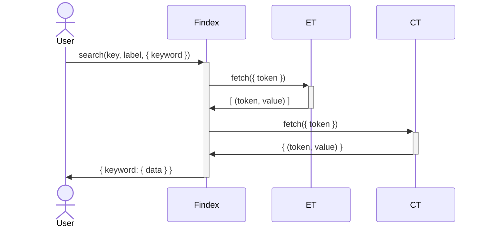
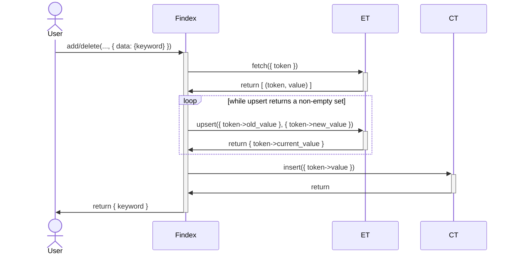
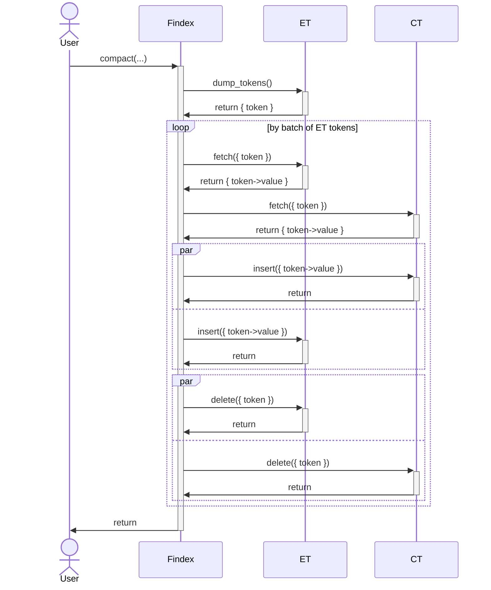

# Findex sequence diagrams

This documents describes the Findex operations using sequence diagrams. Refer
to the [functional documentation](functional.md) in order to understand the
roles of the different participants.

## Search

## Add/Delete

## Compact

